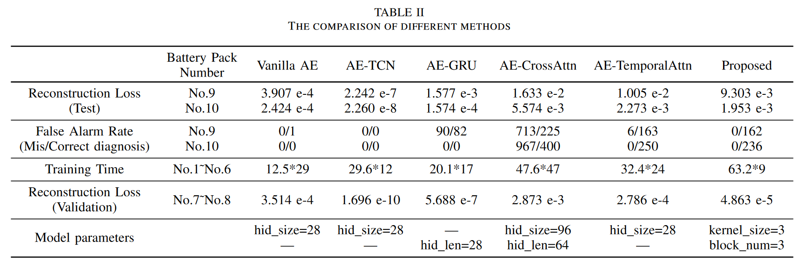

# GRU-TemporalAttention Model with Time Series Decomposition Module for Battery Fault Diagnosis

[中文](file/README_zh.md)|[Paper](file/GRU_TemporalAttention_Model_with_Temporal_Decomposition_Module_for_Battery_Fault_Diagnosis_in_Quadrupedal_Robots.pdf)|[Presentation PPT](file/Xiaolong_Chen_for_2024_ICIT.pptx)

This paper has been accepted for the 2024 IEEE 25th International Conference on Industrial Technology (ICIT).

For further details, please refer to the paper and conference presentation.

## Methodology Model

## Methodology Self-adaptive Dynamic Threshold

To reduce the misdiagnosis rate in fault diagnosis relying on fixed thresholds, an adaptive dynamic threshold method based on battery cell consistency is proposed in this paper.

The figure below shows the reconstruction error of the voltage data for seven battery cells obtained using the model in this paper. The horizontal axis represents time, and the vertical axis represents the reconstruction error value (normalized data).

## Experimental Results

The experimental results indicate that compared to other models, the model in this paper requires fewer training epochs to complete training (Early stopping strategy: on the validation set, training stops if the loss remains higher than the minimum loss for four consecutive epochs). It can achieve a zero false positive rate under dynamic thresholds and detect anomalies within the fault range.

# Acknowledge

[Autoformer](https://github.com/thuml/Autoformer)

[LTSF-Linear](https://github.com/cure-lab/LTSF-Linear)
