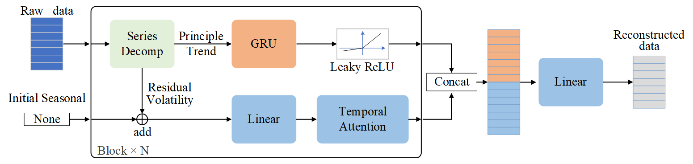
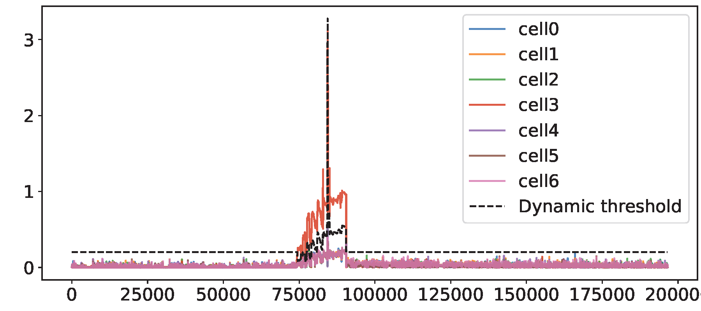
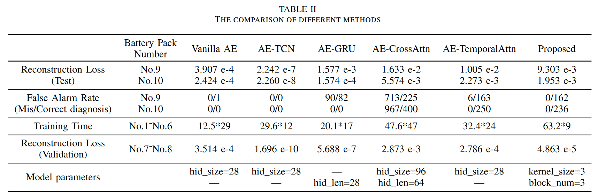

# GRU-TemporalAttention Model with Time Series Decomposition Module for Battery Fault Diagnosis

[英文](../README.md)|[Paper](GRU_TemporalAttention_Model_with_Temporal_Decomposition_Module_for_Battery_Fault_Diagnosis_in_Quadrupedal_Robots.pdf)|[Presentation PPT](Xiaolong_Chen_for_2024_ICIT.pptx)

此篇论文已被2024 IEEE 25th International Conference on xIndustrial Technology(ICIT)录用。

更多细节请参考论文和会议报告。

## 方法 渐进式时序分解与重构网络模型

## 方法  自适应动态阈值

为减少依赖固定阈值进行故障诊断的误报率，本文基于电池包中电池单体的一致性提出了一种自适应阈值。

其效果如下图所示，其中横坐标代表时间，纵坐标代表重构误差（正则化之后的数据），7条实线分别代表使用本文模型得到的电池单体的电压数据的重构误差，黑色虚线代表由这些重构误差计算的自适应阈值。

## 实验结果

实验结果表明，本文模型相对于其他模型，使用较少的训练轮次即可完成训练（早停策略：在验证集上，连续4次损失高于最小损失，即终止训练）。可以在动态阈值下，达到0误报率，并在故障区间内检测出异常。

# Acknowledge

[Autoformer](https://github.com/thuml/Autoformer)

[LTSF-Linear](https://github.com/cure-lab/LTSF-Linear)
